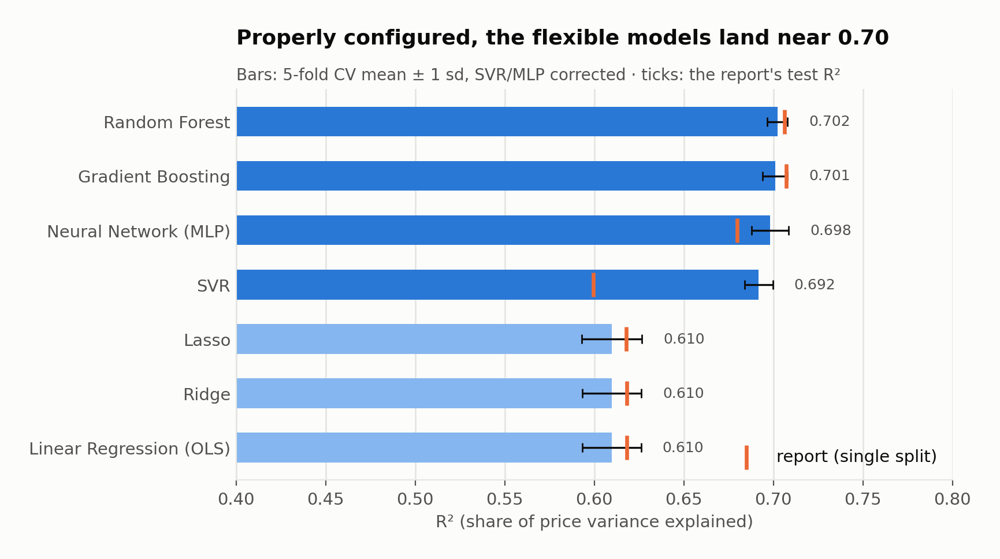
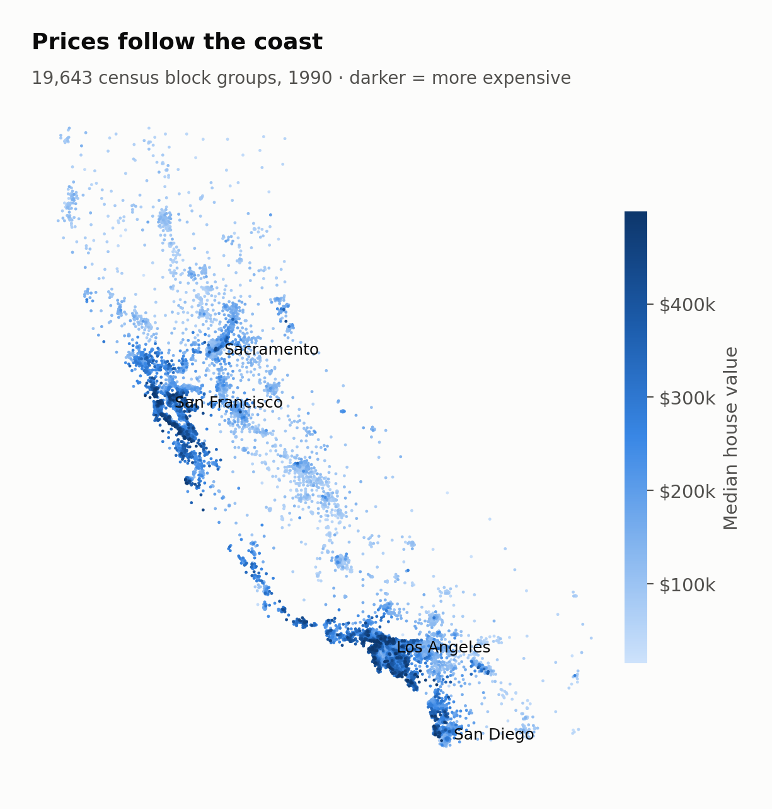
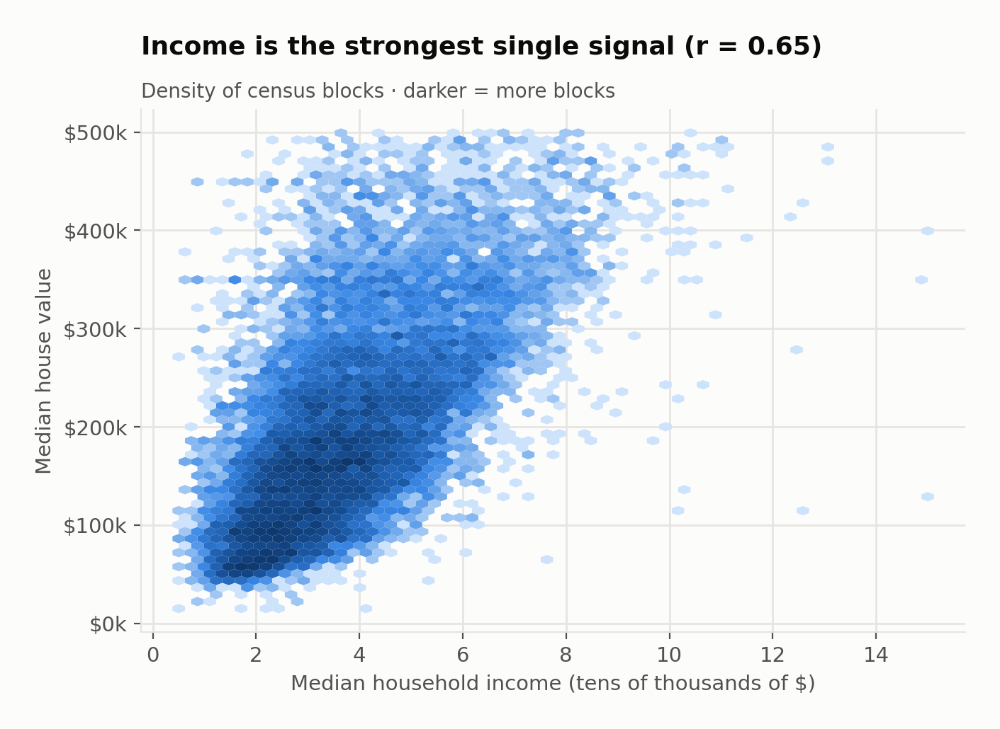
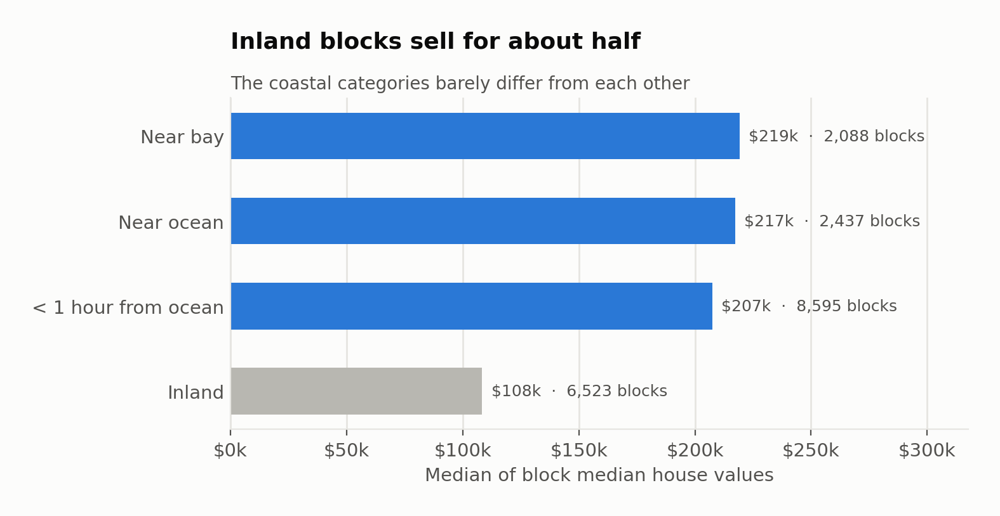
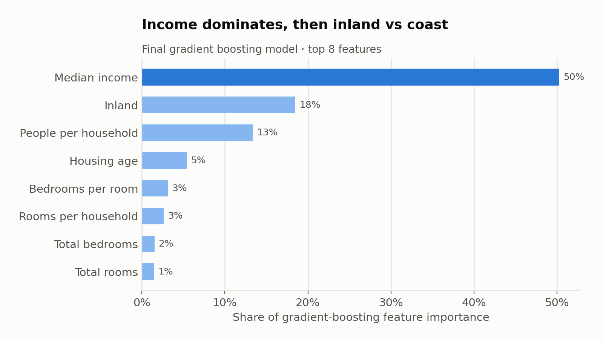
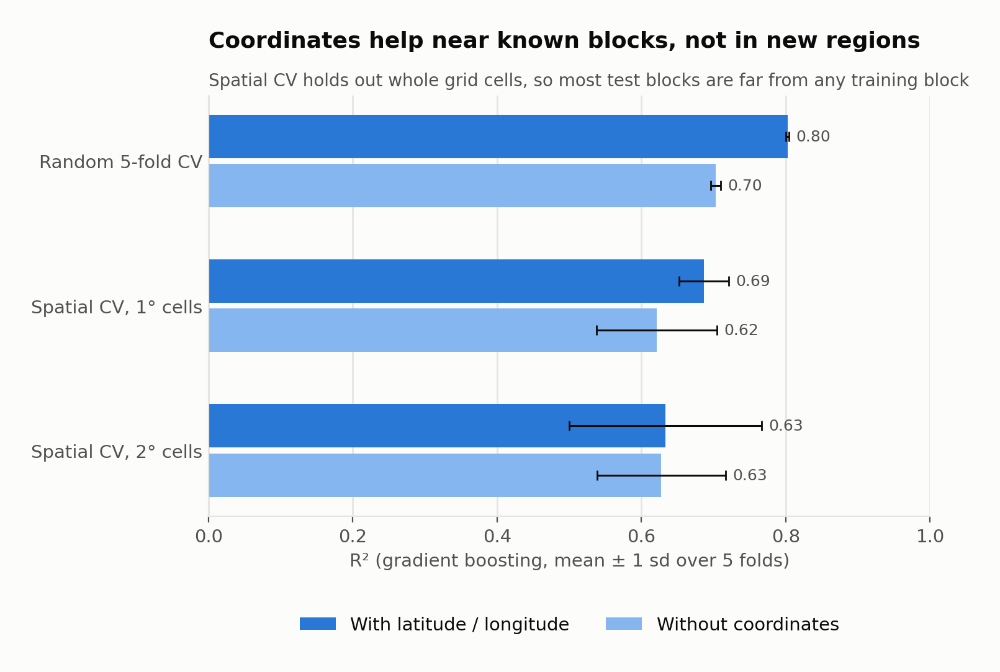
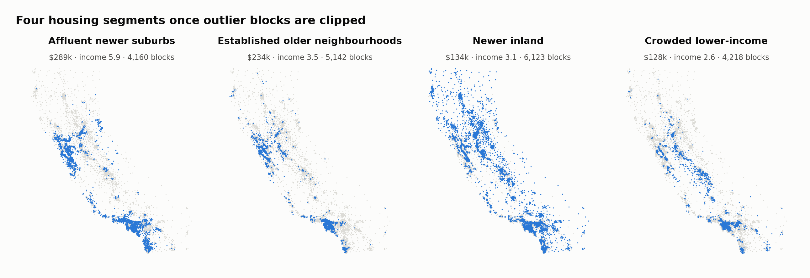
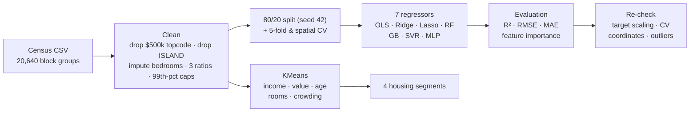

# What predicts California house prices?

**Seven machine learning models, one census dataset, and an honest re-check.** This project cleans the
1990 California Housing census data (19,643 block groups), benchmarks seven regression models from
linear regression to a neural network, and segments the market with KMeans. A second pass then checks
which of the original conclusions hold up.


<p align="center"></p>

| | |
|---|---|
| **Data** | 19,643 California census block groups (1990), median house value as the target |
| **Best models** | Random forest, gradient boosting and a neural network tie at **R² ≈ 0.70** (5-fold CV). SVR is about 0.01 behind and linear models plateau at 0.61 |
| **Strongest drivers** | Median income (about half of model importance), then inland vs coast, then people per household |
| **Biggest improvement** | Adding latitude/longitude lifts R² from **0.70 to 0.80** and cuts RMSE from $52,300 to **$42,700** for blocks near known ones. For brand-new regions the gain mostly disappears |
| **Market segments** | Four clusters: affluent newer suburbs, established older neighbourhoods, newer inland, crowded lower-income |

---

## What drives prices

<table>
<tr>
<td width="50%"></td>
<td width="50%"><br></td>
</tr>
<tr>
<td><b>Location first.</b> The expensive blocks hug the coast around the Bay Area, Los Angeles and San Diego. The Central Valley is cheaper.</td>
<td><b>Income is the strongest single signal</b> (r = 0.65). <b>Inland blocks sell for about half</b> ($108k vs about $210k), while the three coastal categories barely differ from each other.</td>
</tr>
<tr>
<td></td>
<td></td>
</tr>
<tr>
<td><b>The drivers:</b> median income carries about 50% of the final gradient-boosting model's importance, the inland flag 18% and people per household 13%. Raw room and bedroom counts add almost nothing once those are known. The report found the same ordering across its other models.</td>
<td><b>Coordinates help near known blocks, not in new regions.</b> They add 10 points of R² when test blocks sit among training blocks. When whole regions are held out, the gain shrinks to +0.07 on average for 1° cells (varying from −0.01 to +0.16 by fold) and to zero for 2° cells. Most of it is "nearby blocks cost about the same".</td>
</tr>
</table>

<p align="center"></p>

**Four housing segments.** KMeans on income, value, age, rooms and crowding separates affluent newer suburbs
($289k), established older neighbourhoods near the bay and coast ($234k), newer inland developments
($134k) and crowded lower-income blocks ($128k, about 4.5 people per household).

## Re-check: what changed from the original analysis

The project started as a course report. Porting its notebook into tested modules reproduced every number
in the report: six of seven models match to four decimals, and gradient boosting is within 0.0003. A closer look
then changed four conclusions. Each fix is an option in the code, so both versions stay reproducible.

| Original analysis | Issue | Corrected result |
|---|---|---|
| SVR "worst model" (R² 0.60, linear kernel because non-linear kernels scored < 0.50); MLP 0.68 | Both were fit on raw dollar prices. An RBF-kernel SVR can't fit that scale with C = 100 (R² 0.41), so the non-linear kernel was wrongly rejected | Standardised target + RBF kernel: SVR **0.70**. Standardised target + smaller learning rate: MLP **0.705** (about half of the gain from each) |
| "Gradient boosting is the best model" (R² 0.7071 vs RF 0.7063) | Decided on one 80/20 split, a 0.0008 gap | Paired 5-fold CV: RF 0.702, GB 0.701, MLP 0.698 tie (t < 2). SVR trails by 0.01 in every fold |
| Location used only through `ocean_proximity` | Latitude / longitude left out of every model | +0.10 R² near known blocks (0.70 → 0.80). In held-out regions the gain is small and unreliable |
| Three clusters plus a 3-block "cluster 3" | Unclipped ratio outliers (group-quarters blocks such as prisons or dormitories, up to 1,243 people per household) got their own cluster | Clip ratios at the 1st/99th percentile: four segments of 4,160+ blocks |

Smaller notes are in the [audit log](notebooks/03_audit_and_improvements.ipynb). They include cleaning statistics fitted on train and test rows together (re-run leak-free: no measurable change), and four places where the report text disagrees with its code or its own figures.

## Pipeline



## Repository layout

```
data/raw/            california_housing.csv (20,640 rows, 10 columns)
notebooks/
  01_data_and_eda.ipynb              cleaning + what drives prices
  02_models_report.ipynb             the report's seven models, reproduced
  03_audit_and_improvements.ipynb    target scaling, CV, coordinates, audit log
  04_clustering.ipynb                KMeans segments
src/housing/
  data.py         load / clean / split      models.py      7 models, CV, importances
  clustering.py   KMeans + profiles         plots.py       figure styling
scripts/build_notebooks.py   regenerates the notebooks
reports/   model_comparison.csv · model_comparison_report.csv · location_gain.csv
           cluster_profiles.csv · test_predictions.csv (3,929 test blocks, actual vs predicted)
figures/   charts used in this README
tests/     21 tests pinning the report's numbers and the corrected results
```

## Run it

Each notebook has an **Open in Colab** badge at the top. To run locally:

```bash
git clone https://github.com/twillixa/california-housing-ml && cd california-housing-ml
python -m venv .venv && source .venv/bin/activate
pip install -r requirements.txt
pytest -q                                   # 21 tests, ~2.5 min
jupyter nbconvert --to notebook --execute --inplace notebooks/*.ipynb
```

## Data

California Housing dataset from the 1990 U.S. Census (Pace & Barry, 1997, *Sparse spatial autoregressions*,
Statistics & Probability Letters), in the Kaggle version with the `ocean_proximity` column
([shibumohapatra/house-price](https://www.kaggle.com/datasets/shibumohapatra/house-price)). Values are 1990
dollars, so this is a modelling benchmark, not a view of today's market.

## Limitations

- 1990 block-group aggregates: no individual-house features, and prices are 35 years old.
- Blocks at the $500,001 census ceiling (992) are dropped, so the models never see the most expensive areas.
- Hyperparameters are the report's: lightly tuned. A larger search or a modern booster (LightGBM, XGBoost)
  would likely add a little. Location features add more near known blocks.
- The tests pin results to four decimals and were run with Python 3.9, pandas 2.3, numpy 2.0 and scikit-learn 1.6.
  Other versions can shift tree models by around 1e-4.

## Team

Machine Learning in Business Analytics project (UNIL HEC Lausanne, May 2026) by **Mohamed Ben Moctar,
Antonio Aroche and Mila Stojanovic**. The original notebook is in the git history and in
[toni2174301/CFF-](https://github.com/toni2174301/CFF-). This repository is a tested, modular port of it,
with the re-check above added.

Code is released under the [MIT License](LICENSE).
